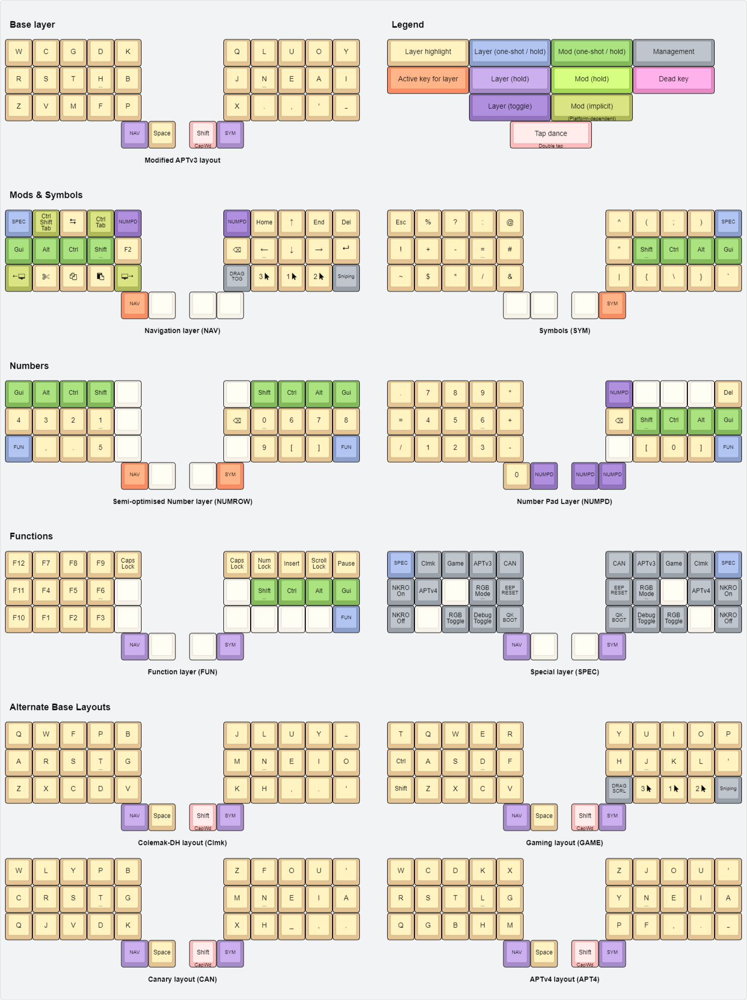

# @casuanoob's userspace

## Layout for [BastardKB](https://bastardkb.com) boards (and other 5x3)

### Base: APTv3 (modified) with [callum style mods](https://github.com/callum-oakley/qmk_firmware/tree/master/users/callum#oneshot-modifiers) and influences from [Miryoku](https://github.com/manna-harbour/miryoku), [Seniply](https://stevep99.github.io/seniply/), and [T-34](https://www.jonashietala.se/blog/2021/06/03/the-t-34-keyboard-layout/)

This is also just a straight up copy of [@delay's](https://github.com/0xcharly/qmk_firmware/tree/users-delay/users/delay) userspace keymap.

### Keymap Layout (generated with keyboard-layout-editor.com)




```
╭────────┬────────┬────────┬────────┬────────╮ ╭────────┬────────┬────────┬────────┬────────╮
│        │        │        │        │        │ │        │        │        │        │        │
├────────┼────────┼────────┼────────┼────────┤ ├────────┼────────┼────────┼────────┼────────┤
│        │        │        │        │        │ │        │        │        │        │        │
├────────┼────────┼────────┼────────┼────────┤ ├────────┼────────┼────────┼────────┼────────┤
│        │        │        │        │        │ │        │        │        │        │        │
╰────────┴────────┼────────┼────────┼────────┤ ├────────┼────────┼────────┼────────┴────────╯
                  │        │        │        │ │        │        │        │
                  ╰────────┴────────┴────────╯ ╰────────┴────────┴────────╯

```
