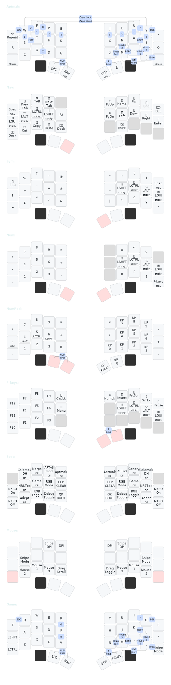

# casuanoob's userspace

## Layout for [BastardKB](https://bastardkb.com) boards (and other 3x5+2)

The layout has coverage of near 100% of all the keys present on a standard 100%
ANSI keyboard in the span of 6 layers and 4 thumb keys - the main exceptions
being `AltGr`, `RCtrl`, `RGui` - without using Layer Taps or Mod Taps except on
the `NumPad` Layer. This is done by using Tri Layers and thumb combos.

The base layer is [Aptmak](https://github.com/Apsu/aptmak), with `V, `Q`, and
`Z`, on combos as an adaptation to allow support on 30 key (23332) layouts like
[Hummingbird](https://github.com/PJE66/hummingbird),
[Batreeq](https://github.com/AlaaSaadAbdo/battoota#batreeq),
[Rommana](https://github.com/AlaaSaadAbdo/Rommana), or
[Luna](https://github.com/mindhatch/keyboards#%E3%83%AB%E3%83%8A-luna), with
minimal modifications.

### Features:

#### Callum's custom oneshot mods
- Chainable, timerless oneshot mods, that can be cleared by tapping the layer
keys.
> [!NOTE]
> ##### From Callum's README:  
> The home row modifiers can either be held and used as normal, or if no other
keys are pressed while a modifier is down, the modifier will be queued and
applied to the next non-modifier keypress. For example to type `shift-ctrl-t`,
type `sym-n-a` (or `nav-h-t`), release, then hit `t`. 
You can and should hit chords as fast as you like because there are no timers
involved. 
Cancel unused modifiers by tapping `nav` or `sym`.

#### [Repeat key](https://docs.qmk.fm/#/feature_repeat_key) 
- Repeats the last pressed keycode, also supports repeating mod+keycode
shortcuts.
The intent of a Repeat key is to reduce same-finger use in double tapping words
where there are doubled letters, to preserve typing flow by turning some SFBs
into rolls instead.

#### Combos
- Shift keys in regular typing are accessed by ring + middle homerow
chord/combo instead of mod-taps as the latency from `COMBO_TERM` can be very
short (<15ms) in comparison to `TAPPING_TERM`, and combos don't block host-side
auto repeating in the same way mod-taps do.
- The F keys and NumPad layers are accessed by chording the home and secondary
thumb key. Requires suitable keycaps to enable the thumb to press both keys
simultaneously.
- A number of combos are also available that provide more convenient access to
keys which are already present on other layers.

### Influences:
- Manna-Harbour's [Miryoku](https://github.com/manna-harbour/miryoku)
- Steve P's [Seniply layout](https://stevep99.github.io/seniply/) 
- Jonas Hietala's [T-34 layout](https://www.jonashietala.se/series/t-34/)

This started out as a straight up copy of
[@delay's](https://github.com/0xcharly/qmk_firmware/tree/users-delay/users/delay)
userspace keymap, especially in regards to the layout wrapper implementation 
and tri-layer arrangement.

### Keymap Layout (generated with Caksoylar's [keymap-drawer](https://github.com/caksoylar/keymap-drawer))

